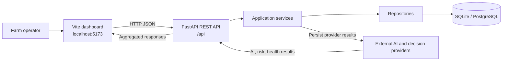
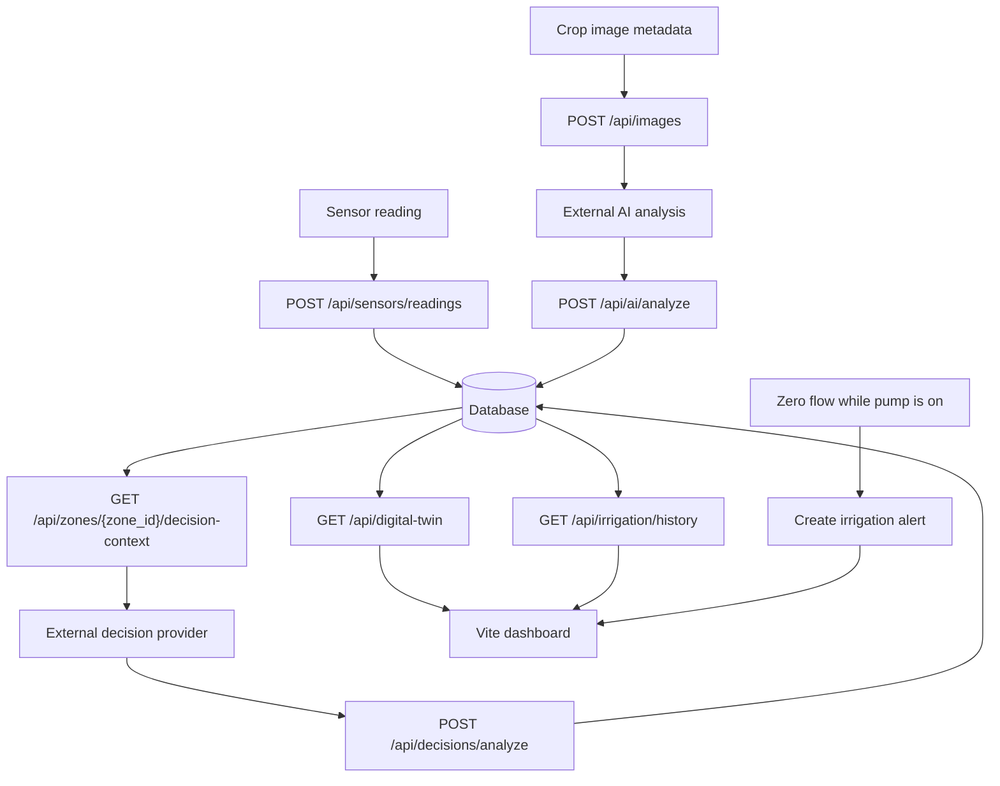
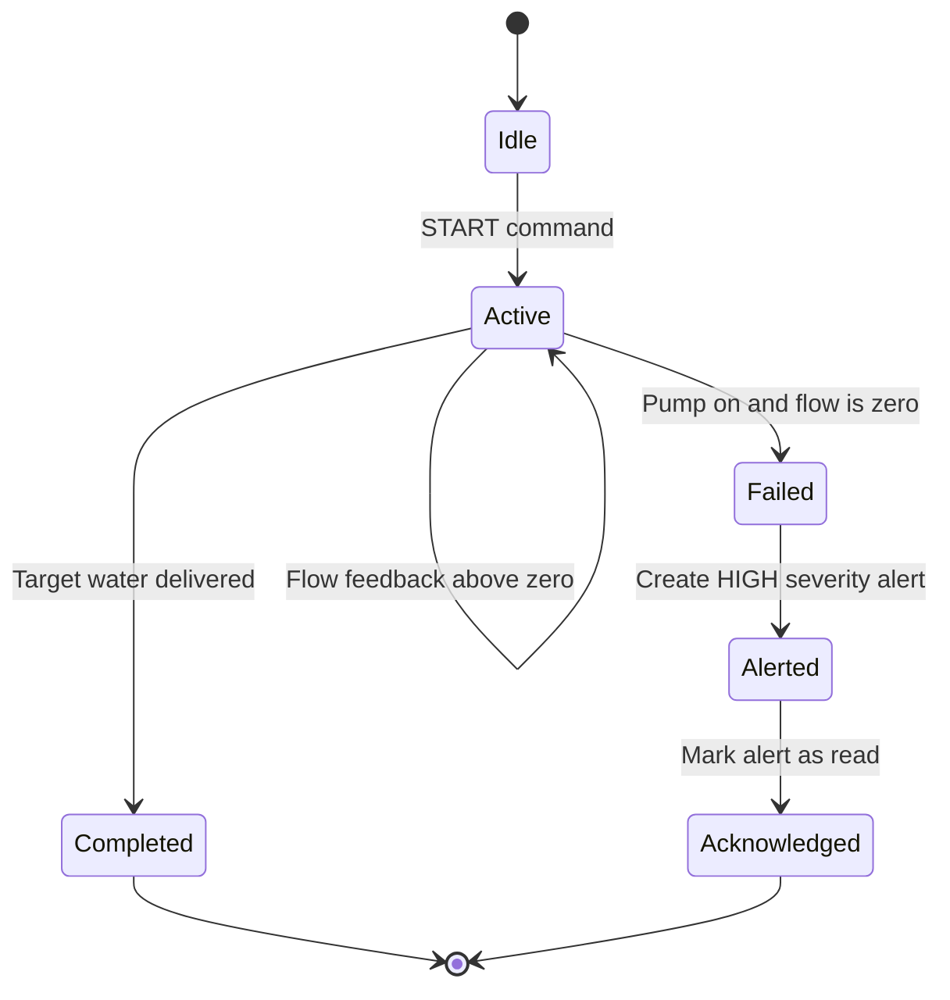

# AgroVisor Edge

AgroVisor Edge is a farm monitoring and precision irrigation platform for Smart India Hackathon 2026 (SIH26180, Qualcomm Inc.). It combines farm and zone management, sensor readings, irrigation control, crop-image metadata, provider-supplied AI results, decision results, alerts, and Digital Twin aggregation behind a REST API.

The repository contains a FastAPI backend, a lightweight Vite dashboard, SQLAlchemy models, and Alembic migrations. SQLite is used for local development and tests; PostgreSQL is the intended production database.

## Current scope

Implemented:

- Farm and zone CRUD workflows
- Sensor reading ingestion and history
- Irrigation commands, flow feedback, fault detection, and alerts
- Crop-image metadata registration
- External AI-result persistence and history
- Provider-supplied decision, risk, and health results
- Digital Twin aggregation for farm and zone views
- REST-based frontend integration with CORS
- Development API access without the temporary `X-API-Key` requirement

Deferred or provider-owned:

- AI model inference
- Rover hardware integration
- WebSocket updates
- Offline synchronization and conflict resolution

The backend stores and returns provider-supplied AI and decision results. It does not fabricate predictions or unsupported risk scores.

## Repository layout

```text
backend/
	app/
		models/        SQLAlchemy persistence models
		repositories/  Database access helpers
		routes/        FastAPI route modules
		schemas/       Pydantic request and response schemas
		services/      Domain and application services
	alembic/         Database migrations
	tests/           API and integration tests
frontend/
	src/api.js       Fetch-based API client
	src/main.js      Dashboard behavior and rendering
	src/style.css    Dashboard styles
docs/              Architecture, API, data contract, and phase documentation
```

## System diagrams

### High-level architecture



### End-to-end data flow



### Irrigation state and fault handling



## Prerequisites

- Python 3.11 or newer
- Node.js 18 or newer and npm
- A shell with the commands shown below

## Backend setup

From the repository root:

```text
cd backend
python -m venv .venv
```

Activate the virtual environment:

```powershell
# Windows PowerShell
.\.venv\Scripts\Activate.ps1
```

```text
# macOS/Linux
source .venv/bin/activate
```

Install development dependencies, create local configuration, and apply migrations:

```text
python -m pip install -e ".[dev]"
copy .env.example .env
python -m alembic upgrade head
```

Start the API server:

```text
python -m uvicorn app.main:app --reload --port 8000
```

Useful backend URLs:

- Health: http://127.0.0.1:8000/api/health
- OpenAPI UI: http://127.0.0.1:8000/docs
- OpenAPI JSON: http://127.0.0.1:8000/openapi.json

All API routes are currently accessible without an API key.

## Frontend setup

In a second terminal, from the repository root:

```text
cd frontend
npm install
npm run dev
```

Open http://localhost:5173. The Vite development proxy forwards `/api` requests to the backend at `http://localhost:8000`.

For a production-style frontend build:

```text
npm run build
npm run preview
```

## Tests and checks

Run these from `backend/` with the virtual environment activated:

```text
python -m pytest -q
python -m ruff check .
python -m compileall -q app alembic
```

The current verification baseline is 17 passing tests. A detailed end-to-end audit is recorded in [VERIFICATION_REPORT.md](VERIFICATION_REPORT.md).

## Configuration

Backend settings are loaded from `backend/.env`:

```dotenv
DATABASE_URL=sqlite:///./agrovisor.db
CORS_ORIGINS=http://localhost:3000,http://localhost:5173
```

Never commit `.env` or local database files. Use `backend/.env.example` as the shareable template. The root `.gitignore` excludes credentials, virtual environments, build output, caches, logs, and local SQLite databases while keeping `.env.example` files trackable.

## API areas

The API is mounted below `/api` and currently exposes:

| Area | Examples |
| --- | --- |
| Health | `GET /api/health` |
| Farms and zones | `GET /api/farms`, `POST /api/farms/{farm_id}/zones` |
| Sensors | `POST /api/sensors/readings`, `GET /api/zones/{zone_id}/readings` |
| Images and AI | `POST /api/images`, `POST /api/ai/analyze` |
| Decisions | `GET /api/zones/{zone_id}/decision-context`, `POST /api/decisions/analyze` |
| Irrigation | `POST /api/irrigation/command`, `POST /api/irrigation/flow` |
| Alerts | `GET /api/alerts`, `PATCH /api/alerts/{alert_id}/read` |
| Digital Twin | `GET /api/digital-twin`, `GET /api/digital-twin/zones/{zone_id}` |

Use the OpenAPI UI at `/docs` for request schemas and the complete endpoint list.

## Database migrations

Create a migration after changing SQLAlchemy models:

```text
cd backend
python -m alembic revision --autogenerate -m "describe change"
python -m alembic upgrade head
```

Check the current revision with:

```text
python -m alembic current
```

## Documentation

The [`docs/`](docs/) directory contains the project overview, system and backend architecture, database design, API specification, data contracts, integration boundaries, security, testing strategy, and delivery phases.

## License

No license has been declared in this repository yet.
